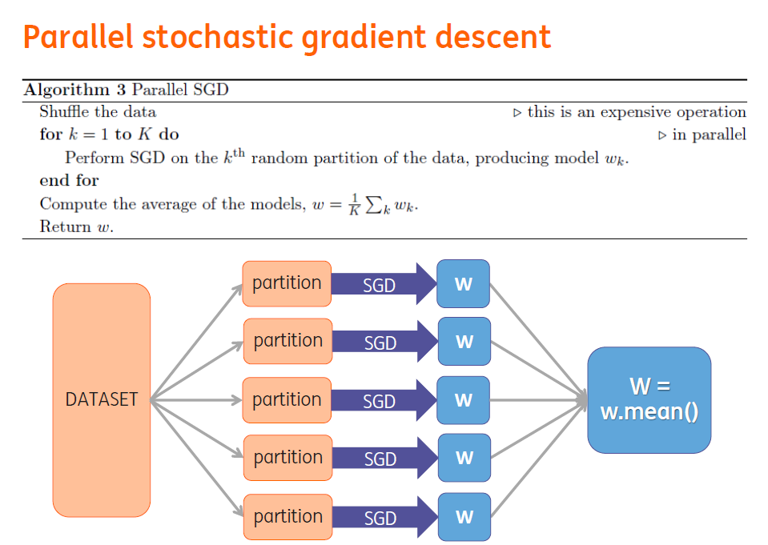

# FM on Spark with parallel SGD

Implementation of Factorization Machines on Spark using parallel stochastic gradient descent (python and scala)

Factorization Machines is a smart general predictor introduced by Rendle in [2010](http://www.ismll.uni-hildesheim.de/pub/pdfs/Rendle2010FM.pdf), which can capture all single and pairwise interactions in a dataset. It can be applied to any real valued feature vector and also performs well on highly sparse data. An extension on FMs, namely Field Factorization Machines, proved to be a successful method in predicting advertisement clicks in the [Display Advertising Challenge on Kaggle](https://www.kaggle.com/c/criteo-display-ad-challenge/forums/t/10555/3-idiots-solution-libffm).

I built a custom Spark implementation to use in Python and Scala.
To make optimum use of  parallel computing in Spark, I implemented Parallel Stochastic Gradient Descent to train the FMs. This forms an alternative to Mini-batch SGD, which is currently available in MLLib to train Logistic Regression models.

 
 
 

This implementation shows impressive results in terms of speed and effectivness.

I worked on this project during my summer internship at ING Netherlands in 2015. ING has strong teams of data scientists and I thank them for their help during this project. I could also use a powerful cluster to test my code and train my models.

## Tutorial
Here's a short tutorial on how to use them in pyspark. (Note: the procedure is quite the same in scala, see below)
You may prefer try it directly using the ipython notebook tutorial *FMonSpark_demo_a9a.ipynb*. You will need to download the [a9a dataset](https://www.csie.ntu.edu.tw/~cjlin/libsvmtools/datasets/binary.html#a9a) first.

### Pyspark

1. import the script **fm_parallel_sgd.py**. You can do this by adding the following lines to your code:

   **sc.addPyFile("spark-FM-parallelSGD/fm/fm_parallel_sgd.py")**

   **import fm_parallel_sgd as fm**

   or by running the codes directly when starting spark:

   **pyspark –py-files spark-FM-parallelSGD/fm/fm_parallel_sgd.py**

2. Preprocess your data such that you

 a) Divide it into test and train
 
 b) The data is an RDD with labeled points
  - Labels should be -1 or 1. If your data has 0/1 labels, transform them with the function *fm.transform_data(data)*
  - Features should be either *SparseVector* or *DenseVector* from *mllib.linalg* library.

3. If you think it makes sense, take a (stratified) sample of you data using *RDD.sample()*. this is not done as part of the fm procedure
4. How many partitions is your data? The performance of the parallel sgd is best with as few partitions as possible. Coalesce your data into 1 or 2 partitions per excecutor by using *coalesce(nrPartitions)* or *repartition(nrPartitions)* on your RDD
5. Call the function **fm.trainFM_parallel_sgd(sc, train, params...)**. There are the following parameters that you can specify:
 - *iterations* : Nr of iterations of parallel SGD. default=50
 - *iter_sgd* : Nr of iterations of SGD in each partition. default=5 (between 1 and 10 is better)
 - *alpha* : Learning rate of SGD. default=0.01
 - *regParam* : Regularization parameter. default=0.01
 - *factorLength* : Length of the weight vectors of the FMs. default=4
 - *verbose*: Whether to ouptut evaluations on train and validation set after each iteration. (the code split your dataset into train(80%) + validation(20%) sets)
 - *savingFilename*: Whether to save the model after each iteration. The file is saved in a pickle file into your current folder.
 - *evalTraining* : Useful to plot the evolution of the evaluation during the training.
   - Instance of the class evaluation. Create the instance before using fm.trainFM_parallel_sgd !
    - You can set a modulo to evaluate the model after each *#modulo* iterations with *‘instance’.modulo*

6. This returns a weight matrix **w**. if you want to store this for future use, you can use the function *fm.saveModel(w, "path/to/store/model")*
7. To evaluate the perfomance of the model on the test set, call **fm.evaluate(train, w)**. This returns the area under the Precision/recall curve, the AUC of ROC, the average logloss, the MSE and the accuracy.
8. To calculate the probabilities according to the model for a test set, call *fm.predictFM(data, w)*. This returns an RDD with probability scores.
9. To load a model that you saved, you can use the function **fm.loadModel("path/to/store/model”)**

##### Plot :
1. You can plot the error (rtv_pr_auc, rtv_auc, logl, MSE) function of different learning rates by using **fm.plotAlpha(sc, data, alpha_list, params…)**. *'alpha_list’* is a list of the learnings rates you want to test. The training is on 80% of the data, the evaluation is on the remaining 20%.
2. You can do the same for the regularization parameter and the factor length with **fm.plotRegParam(sc, data, regParam_list, params…)** and **fm.plotFactorLength(sc, data, factorLength_list, params…)**
3. You can plot a color map of the logloss function for learning rate/regParam combinations using **fm.plotAlpha_regParam(sc, data, alpha_list, regParam_list, params…)**. The brighter square is the lower logloss. The training is on 80% of the data, the evaluation is on the remaining 20%.

### Scala

1. Load the file **fm_parallel_sgd.scala**. You can do this by adding the following lines to your code:

    **:load spark-FM-parallelSGD/fm/fm_parallel_sgd.scala**

    or by running the code directly when starting spark

    **spark-shell –i spark-FM-parallelSGD/fm/fm_parallel_sgd.scala**

2. Preprocess your data such that you

 a) Divide it into test and train
 
 b) The data is an RDD with labeled points
  - Labels should be -1 or 1.
  - Features should be *Vector* from *mllib.linalg*.

3. If you think it makes sense, take a (stratified) sample of you data using *RDD.sample()*. this is not done as part of the fm procedure
4. How many partitions is your data? The performance of the parallel sgd is best with as few partitions as possible. Coalesce your data into 1 or 2 partitions per excecutor by using *coalesce(nrPartitions)* or *repartition(nrPartitions)* on your RDD
5. Call the function **fm.trainFM_parallel_sgd(train, params...)**. There are the following parameters that you can specify:
 - *iterations* : Nr of iterations of parallel SGD. default=50
 - *iter_sgd* : Nr of iterations of SGD in each partition. default=5 (between 1 and 10 is better)
 - *alpha* : Learning rate of SGD. default=0.01
 - *regParam* : Regularization parameter. default=0.01
 - *factorLength* : Length of the weight vectors of the FMs. default=4
 - *verbose*: Whether to ouptut evaluations on train and validation set after each iteration. (the code split your dataset into train(80%) + validation(20%) sets)

6. This returns a weight matrix **w**.
7. To evaluate the perfomance of the model on the test set, call **fm.evaluate(train, w)**. This returns the average logloss.
8. To calculate the probabilities according to the model for a test set, call **fm.predictFM(data, w)**. This returns an RDD with probability scores.

